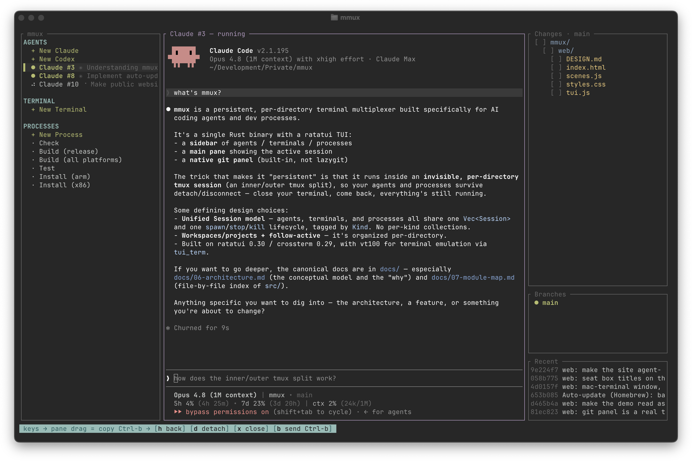

# mmux




**Persistent terminals for your AI coding agents**

**[mmux.org](https://mmux.org)**

A terminal multiplexer in a single Rust binary. Type `mmux` in a project and you
get a TUI: a left sidebar of **Agents** (Claude, Codex, … you spawn on demand), **Terminals**,
and **Processes** (dev servers, scripts you start/stop and watch), a main pane showing the
focused program, and a built-in **git panel** on the right.

The whole thing runs inside an invisible, per-directory **tmux session**, so:

- there is exactly **one** mmux per directory, and
- it keeps running after you close the terminal or drop SSH — run `mmux` again, or `mmux attach`
  from anywhere, to rejoin.

Even after you **quit** (or a crash, or a restart-to-update), reopening a directory **restores your
session** — Claude/Codex agents resume their conversation and terminals reopen where you left them.

When an agent goes idle — finished, or waiting on you — its sidebar row lights up **green**. And
when a program rings the bell or emits a notification escape (e.g. Claude Code announcing it's
done), mmux raises a native desktop notification — even over SSH.

## Install

```sh
brew install marvinvr/mmux/mmux
```

Or build from source with [Rust](https://rustup.rs):

```sh
cargo install --path .
```

mmux needs **tmux** on your `PATH`. The git panel uses `git`; the `Ctrl+P` file picker opens
files in your `$EDITOR`. See [Installation](docs/02-installation.md) for prebuilt binaries and
the macOS code-signing note.

A Homebrew install **keeps itself up to date**: it checks in the background on startup and every 6
hours, installs new releases automatically, and shows a quiet `↻ restart to update` badge — press
`U` (or click it) to restart in place (your session is restored, as above). See
[Auto-Update](docs/04-configuration.md#auto-update).

## Quick Start

```sh
cd ~/some/project
mmux init      # interactive setup: agents, start commands, linked projects
mmux           # open / reattach

mmux a         # `mmux attach`: pick any running session and rejoin
```

In the TUI: `↑`/`↓` move · `Enter` opens a `+ New …` row or jumps into a session · `s`/`x`/`r`
start/close/restart · `Tab` focuses the git panel · `Ctrl+P` opens the file picker · `d` detaches
· `q` quits. In a focused pane, `Ctrl-b h` returns to the sidebar. The full key reference is in
[Usage](docs/03-usage.md).

## Configure

Two layers, merged at launch — a global `~/.mmux/config.yaml` with each project's `mmux.yaml` on
top:

```yaml
# ~/.mmux/config.yaml — your agents, everywhere
agents:
  - name: Claude
    cmd: claude
    args: ["--dangerously-skip-permissions"]
```

```yaml
# ./mmux.yaml — this project's bits
name: my-workspace
processes:
  - name: Dev server
    cmd: npm
    args: ["run", "dev"]
    autostart: false
    # stop: docker compose down   # optional: run in cwd when stopped or on quit
```

A private, git-ignored `./mmux.local.yml` can **deep-override** the project file — overriding just
the keys it names (down to a single nested field) and leaving the rest intact.

`mmux check` prints the effective merged config; `mmux docs` prints a self-contained setup guide.
See [Configuration](docs/04-configuration.md) for the full schema, the merge rules,
[local overrides](docs/04-configuration.md#local-overrides--mmuxlocalyml), and
[linked projects](docs/04-configuration.md#linked-projects) (several projects in one sidebar).

## Documentation

The canonical docs live in **[`docs/`](docs/)**:

- [Overview](docs/00-overview.md) · [Quick Start](docs/01-quick-start.md) ·
  [Installation](docs/02-installation.md)
- [Usage](docs/03-usage.md) — the interface, every keybinding, the git panel, the mouse
- [Configuration](docs/04-configuration.md) · [Notifications](docs/05-notifications.md)
- [Architecture](docs/06-architecture.md) · [Module Map](docs/07-module-map.md) ·
  [Contributing](docs/08-contributing.md)

Working on the codebase? Start with [`AGENTS.md`](AGENTS.md).

## License

GPLv3-or-later — see [LICENSE](LICENSE). Copyright © 2026 Marvin von Rappard.

By [@marvinvr](https://marvinvr.ch)
